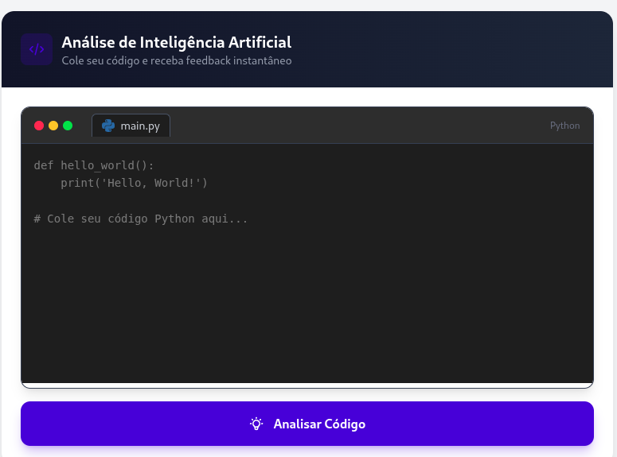

# *#*  HumanFlow AI

**Plataforma de Code Review Inteligente impulsionada por IA**


---


 

---

## *#* O que é o Projeto

**HumanFlow AI** é um SaaS Full Stack que utiliza o modelo **Google Gemini 2.5 Flash** para analisar código em tempo real. A ferramenta detecta vulnerabilidades de segurança (OWASP), bugs de performance e code smells, fornecendo feedback instantâneo e detalhado num dashboard moderno.

### Por que usar o HumanFlow AI?

- ✅ Análise automatizada de código com IA de última geração
- ✅ Feedback instantâneo sobre qualidade e segurança
- ✅ Interface moderna e intuitiva
- ✅ Histórico completo de análises
- ✅ 100% containerizado com Docker

---

## ✨ Funcionalidades Principais

| Feature | Descrição |
|---------|-----------|
|  **Análise de Segurança** | Detecção proativa de falhas críticas baseada em padrões OWASP |
|  **Editor Inteligente** | Syntax highlighting para Python em tempo real |
|  **Dashboard de Histórico** | Acompanhamento da evolução da qualidade do código (Score 0-100) |
|  **UI Enterprise** | Interface moderna, responsiva com Design System Navy/Tech Blue |
|  **Zero Config** | Ambiente de desenvolvimento 100% dockerizado |

---

## *#* Tech Stack

### Frontend
- **Next.js 16** (App Router)
- **TypeScript** 5.0
- **TailwindCSS 4** (Design System personalizado)
- **Lucide React** (Ícones)
- **Axios** (HTTP Client)

### Backend
- **Python 3.11**
- **FastAPI** (Framework Web)
- **Pydantic** (Validação de dados)
- **SQLAlchemy** (ORM Async)
- **Google Generative AI SDK** (Gemini 2.5 Flash)

### Database & Infra
- **PostgreSQL 15**
- **Docker & Docker Compose**
- **Alembic** (Migrações)

---

## *#* Guia de Instalação

### Pré-requisitos

Certifique-se de ter instalado:
- [Docker](https://docs.docker.com/get-docker/) (v20.10+)
- [Docker Compose](https://docs.docker.com/compose/install/) (v2.0+)

### Passo 1: Clonar o Repositório

```bash
git clone https://github.com/seu-usuario/humanflow-ai.git
cd humanflow-ai
```

### Passo 2: Configurar Variáveis de Ambiente

Crie um arquivo `.env` na raiz do projeto:

```bash
cp .env.example .env
```

Edite o arquivo `.env` com suas configurações:

```env
# Google AI
GOOGLE_API_KEY=sua_chave_api_do_google_aqui

# PostgreSQL
POSTGRES_USER=humanflow
POSTGRES_PASSWORD=humanflow_secret_2024
POSTGRES_DB=humanflow_db
POSTGRES_SERVER=db
POSTGRES_PORT=5432

# Security
SECRET_KEY=sua_chave_secreta_super_segura_aqui
```

> 💡 **Dica:** Obtenha sua `GOOGLE_API_KEY` em [Google AI Studio](https://aistudio.google.com/app/apikey)

### Passo 3: Executar o Projeto

```bash
docker-compose up --build
```

Aguarde todos os containers iniciarem. Na primeira execução, as migrações do banco serão aplicadas automaticamente.

### Passo 4: Acessar a Aplicação

| Serviço | URL |
|---------|-----|
| *#* **Frontend** | [http://localhost:3000](http://localhost:3000) |
| *#* **API Docs (Swagger)** | [http://localhost:8000/docs](http://localhost:8000/docs) |
| *#* **API ReDoc** | [http://localhost:8000/redoc](http://localhost:8000/redoc) |

---

## *#* Estrutura do Projeto

```
humanflow-ai/
├── 📂 backend/                 # API FastAPI + Lógica de IA
│   ├── 📂 alembic/             # Migrações do banco de dados
│   ├── 📂 app/
│   │   ├── 📂 api/             # Endpoints da API
│   │   │   └── 📂 v1/
│   │   │       └── 📂 endpoints/
│   │   ├── 📂 core/            # Configurações
│   │   ├── 📂 db/              # Conexão com banco
│   │   ├── 📂 models/          # Modelos SQLAlchemy
│   │   ├── 📂 schemas/         # Schemas Pydantic
│   │   ├── 📂 services/        # Lógica de negócio (AI Analyzer)
│   │   └── main.py             # Entry point
│   ├── Dockerfile
│   └── requirements.txt
│
├── 📂 frontend/                # Next.js + TailwindCSS
│   ├── 📂 src/
│   │   ├── 📂 app/             # App Router (pages)
│   │   ├── 📂 components/      # Componentes React
│   │   └── 📂 services/        # API Client
│   ├── Dockerfile
│   └── package.json
│
├── 📂 infra/                   # Scripts de infraestrutura
├── docker-compose.yml          # Orquestração dos containers
├── .env.example                # Template de variáveis
└── README.md                   # Este arquivo
```

---

## *#* Comandos Úteis

```bash
# Iniciar todos os serviços
docker-compose up -d

# Ver logs em tempo real
docker-compose logs -f

# Reiniciar apenas o backend
docker-compose restart backend

# Executar migrações manualmente
docker-compose exec backend alembic upgrade head

# Criar nova migração
docker-compose exec backend alembic revision --autogenerate -m "descricao"

# Parar todos os serviços
docker-compose down

# Limpar volumes (reset do banco)
docker-compose down -v
```

---

## *#* Contribuição

Contribuições são bem-vindas! Para contribuir:

1. Faça um Fork do projeto
2. Crie uma branch para sua feature (`git checkout -b feature/nova-feature`)
3. Commit suas mudanças (`git commit -m 'feat: adiciona nova feature'`)
4. Push para a branch (`git push origin feature/nova-feature`)
5. Abra um Pull Request

### Padrões de Commit

Utilizamos [Conventional Commits](https://www.conventionalcommits.org/):
- `feat:` Nova funcionalidade
- `fix:` Correção de bug
- `docs:` Documentação
- `style:` Formatação
- `refactor:` Refatoração de código

---

## *###* Licença *###* 

Este projeto está sob a licença MIT. Veja o arquivo [LICENSE](LICENSE) para mais detalhes.

```
MIT License

Copyright (c) 2024 HumanFlow AI

Permission is hereby granted, free of charge, to any person obtaining a copy
of this software and associated documentation files (the "Software"), to deal
in the Software without restriction, including without limitation the rights
to use, copy, modify, merge, publish, distribute, sublicense, and/or sell
copies of the Software, and to permit persons to whom the Software is
furnished to do so, subject to the following conditions:

The above copyright notice and this permission notice shall be included in all
copies or substantial portions of the Software.
```

---

## 👨‍💻 Autor

Desenvolvido por **[KreaKodo](https://kreakodo.com)** By **[Pedro Pompeu](https://www.linkedin.com/in/pedro-pompeu/)** 

[](https://linkedin.com/in/pedro-pompeu/)
[](https://github.com/pedropompeu)

---

<p align="center">
  <strong>⭐ Se este projeto te ajudou, deixe uma estrela!</strong>
</p>
